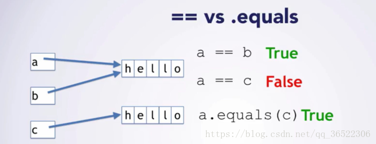

# 答案

## 1. 基础

[参考资料1](https://blog.csdn.net/jiankunking/article/details/52673302)

[参考资料2](https://www.cnblogs.com/captainad/p/10905184.html)

1. HashMap底层结构实现方式

   ```java
   public class HashMap<K,V> extends AbstractMap<K,V>
   implements Map<K,V>, Cloneable, Serializable {
   ```

   - HashMap 继承自一个抽象类，实现了Map接口。HashMap是无序的，若要保持元素的输入顺序应该使用LinkedHashMap

   - 除了非同步和允许使用null之外，HashMap与Hashtable基本一致。此处的非同步指的是多线程访问，并至少一个线程修改HashMap结构。结构修改包括任何新增、删除映射，但仅仅修改HashMap中已存在项值得操作不属于结构修改。

   - 初始容量与加载因子是影响HashMap的两个重要因素。 

     > public HashMap(int initialCapacity, float loadFactor)

     - ```java
       /**
        * The default initial capacity - MUST be a power of two.
        */
       static final int DEFAULT_INITIAL_CAPACITY = 1 << 4; // aka 16
       
       /**
        * The maximum capacity, used if a higher value is implicitly specified
        * by either of the constructors with arguments.
        * MUST be a power of two <= 1<<30.
        */
       static final int MAXIMUM_CAPACITY = 1 << 30;
       
       /**
        * The load factor used when none specified in constructor.
        */
       static final float DEFAULT_LOAD_FACTOR = 0.75f;
       ```

       容量是HashMap在创建时“桶”的数量，而初始容量是哈希表在创建时分配的空间大小。加载因子是哈希表在其容量自动增加时能达到多满的衡量尺度（比如默认为0.75，即桶中数据达到3/4就不能再放数据了）。

       > 默认的负载因子大小为0.75，也就是说，当一个map填满了75%的bucket时候，和其它集合类(如ArrayList等)一样，将会创建原来HashMap大小的两倍的bucket数组，来重新调整map的大小，并将原来的对象放入新的bucket数组中。这个过程叫作rehashing，因为它调用hash方法找到新的bucket位置。
       >
       > **HashMap应该避免在多线程环境下使用**
       
       默认0.75这是时间和空间成本上一种折衷：增大负载因子可以减少 Hash 表（就是那个 Entry 数组）所占用的内存空间，但会增加查询数据的时间开销，而查询是最频繁的的操作（HashMap 的 get() 与 put() 方法都要用到查询）；减小负载因子会提高数据查询的性能，但会增加 Hash 表所占用的内存空间。

   - put 使用尾插法
   
   - 触发resize的条件有两个：1. 列表的使用率超过了threshold  (HashMap的长度initialCapacity×loadFactor)    2. 一个链的长度超过8

   - 由链表变成树（红黑树）的条件为：链表长度超过64

2. Hashmap为什么2倍扩容？
   [为什么2倍扩容](https://blog.csdn.net/soulofball/article/details/108951697)

   ```java
   n = table.length();       //n在这里是HashMap的长度，而长度一定是2的倍数
   index = (n - 1) & hash
   ```

   这种计算方式可以减少哈希碰撞的几率，扩容为2的幂，可以保证不容易产生碰撞，

   如果是4倍，则会浪费空间

3. HashMap,TreeMap,LinkedHashMap的区别

   [HashMap,TreeMap,LinkedHashMap的区别](https://www.cnblogs.com/natian-ws/p/10762213.html)

   Output of HashMap:

   ```
   -1, 0, 1, -2, 2,     
   // ordering of the keys is essentially arbitrary (any ordering)
   ```

   Output of LinkedHashMap:

   ```
    1, -1, 0, 2, -2,     
   // Keys are ordered by their insertion order
   ```

   Output of TreeMap:

   ```
    -2, -1, 0, 1, 2,   
   // Keys are in sorted order
   ```

   
   
   LinkedHash在其他地方与Hashmap完全相同，只是在创建新的Node时不同，用一个双向链表来维持所有的节点，保证输出时可以按照插入顺序进行输出


4. 红黑树

   [红黑树](https://blog.csdn.net/qq_36610462/article/details/83277524)

5. 解决hash碰撞的4种方法

   **开放地址法；再哈希法；链地址法（拉链法）；公共溢出区法。**

6. HashMap是线程不安全的

   1. put的时候导致的多线程数据不一致

      比如有两个线程A和B，首先A希望插入一个key-value对到HashMap中，首先计算记录所要落到的 hash桶的索引坐标，然后获取到该桶里面的链表头结点，此时线程A的时间片用完了，而此时线程B被调度得以执行，和线程A一样执行，只不过线程B成功将记录插到了桶里面，假设线程A插入的记录计算出来的 hash桶索引和线程B要插入的记录计算出来的 hash桶索引是一样的，那么当线程B成功插入之后，线程A再次被调度运行时，它依然持有过期的链表头但是它对此一无所知，以至于它认为它应该这样做，如此一来就覆盖了线程B插入的记录，这样线程B插入的记录就凭空消失了，造成了数据不一致的行为。

7. 线程安全的Map

   - Hashtable     使用开放地址法解决hash碰撞，（线性探测法）
   - ConcurrentHashMap
   - Synchronized Map

   [参考文献](https://www.cnblogs.com/yucfeng/p/9035308.html)
   
8. ArrayList、LinkedList、Vector区别

   1. 实现方式：

      ArrayList: 数组

      Vector: 数组

      LinkedList: 双向链表

   2. 线程安全：

      ArrayList: 不安全

      Vector: 安全

      LinkedList: 不安全

   3. 扩容：

      ArrayList:  初始容量是10，扩容是50%

      Vector: 初始容量是10，扩容是100%

9. Class.forName和classloader的区别

   Class.forName()除了将.class文件加载到内存中，还会对类进行初始化，执行static块中代码，如JDBC注册驱动。

   ClassLoader只将加载类到内存中，不会对类进行初始化。

10. ==与equals的区别

    [==与equals的区别](https://blog.csdn.net/qq_36522306/article/details/80550210)

    > 1、基本数据类型：比较的是他们的值是否相等，比如两个int类型的变量，比较的是变量的值是否一样。
    > 其中基本数据类型有8个：byte(8位)、short(16位)、int(32位)、long(64位)、float(32位)、double(64位)、char(16位)、boolean(true和false)。
    > 八大基本数据类型对应着各自的封装类型，提供了更多的方法，且不进行初始化时，值默认为空（基本数据类型必须初始化）。
    > 2、引用数据类型：比较的是引用的地址是否相同，比如说新建了两个User对象，比较的是两个User的地址是否一样。

    1.  ==是判断两个变量或实例是不是指向同一个内存空间，equals是判断两个变量或实例所指向的内存空间的值是不是相同 
    2. ==是指对内存地址进行比较 ， equals()是对字符串的内容进行比较
    3. ==指引用是否相同， equals()指的是值是否相同

    


​	对于对象来讲，没有区别，都是判断地址是否相同：

```java
		TestEqu e1 = new TestEqu(1);
        TestEqu e2 = new TestEqu(1);

        System.out.println(e1==e2);
        System.out.println(e1.equals(e2));
```

结果

```java
false
false
```

对于基本数据类型来讲是不同的：

```java
		String a = new String("123");
        String b = new String("123");
        System.out.println(a==b);
        System.out.println(a.equals(b));
```

结果

```
false
true
```


11. 什么是多态

    同一操作作用于不同的对象，可以有不同的解释，产生不同的执行结果，这就是多态性。简单的说:就是用基类的引用指向子类的对象。在运行时动态绑定，称为多态。

12. hashcode（）相同，equals一定相同吗

    不一定，可能产生hash碰撞

13. 有抽象类了为什么还要有接口

    java中的继承是单继承的，只能继承自一个父类。而可以实现多个接口，接口解决了多继承的问题。

    class和interface所反映出的设计理念不同。其实abstract class表示的是"is-a"关系，interface表示的是"like-a"关系。


14. string、stringbulider、stringbuffer的区别

    string是常量

    stringbuilder线程不安全

    stringbuffer线程安全

    ***\*运行速度快慢为：StringBuilder > StringBuffer > String\****

    **String：适用于少量的字符串操作的情况**

    **StringBuilder：适用于单线程下在字符缓冲区进行大量操作的情况**

    **StringBuffer：适用多线程下在字符缓冲区进行大量操作的情况**


15. java 集合

    [java集合](https://www.jellythink.com/archives/640)


## 2. JVM虚拟机

1. java内存区域

2. STW（stop the world，垃圾回收线程工作的话会暂停用户线程的执行）？ 工作线程暂停的话是立马暂停吗
   不是马上暂停，是到达安全点才停止，安全点一般设置在执行时间较长的地方，例如函数调用，循环跳转，异常跳转等


# 3. 多线程

[多线程-锁](https://bruceeezhao.github.io/2020/11/01/Java%E5%A4%9A%E7%BA%BF%E7%A8%8B/)

**死锁原因：**
（1） 因为系统资源不足。
（2） 进程运行推进的顺序不合适。
（3） 资源分配不当等。

**产生死锁的四个必要条件：**
（1） 互斥条件：一个资源每次只能被一个进程使用。
（2） 请求与保持条件：一个进程因请求资源而阻塞时，对已获得的资源保持不放。
（3） 不剥夺条件:进程已获得的资源，在末使用完之前，不能强行剥夺。
（4） 循环等待条件:若干进程之间形成一种头尾相接的循环等待资源关系。
这四个条件是死锁的必要条件，只要系统发生死锁，这些条件必然成立，而只要上述条件之一不满足，就不会发生死锁。

 

**避免死锁的方法：**

1.加锁顺序：当多个线程要相同的一些锁，但是按照不同的顺序加锁，死锁的情况发生率较高，如果，程序运行能确保所有线程都是按照相同的顺序去获得锁，那么死锁就不会发生。

 2.加锁时限：加一个超时时间，若一个线程没有在给定的时间内成功获取所需的锁，则进行回退操作，并释放自己本身所持有的锁，一段随机时间之后，重新去获取锁。

3.死锁检测：死锁检测，每当线程去获取锁的时候，会在线程和锁相关的数据结构中将其记下，除此之外，每当线程请求锁，都需要记录在数据结构中。死锁检测是一个死锁避免机制。他主要针对的时那些不可能实现按序加锁并且锁超时也不可行的应用场景。


进程是独立拥有资源的基本单位，线程是独立调度的基本单位