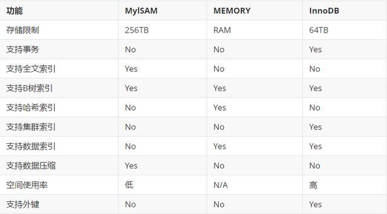

# 1. 基础知识

## 1.1. 数据库都有那些引擎，有什么区别，应用场景？




[mysql引擎](https://baijiahao.baidu.com/s?id=1655327558614401593&wfr=spider&for=pc)

## 1.2. 数据库有那些锁？

|--表级锁（锁定整个表）

|--页级锁（锁定一页）

|--行级锁（锁定一行）

|--共享锁（S锁，MyISAM 叫做读锁）

|--排他锁（X锁，MyISAM 叫做写锁）

|--悲观锁（抽象性，不真实存在这个锁）

|--乐观锁（抽象性，不真实存在这个锁）


|--共享锁：对某一资源加共享锁，自身可以读该资源，其他人也可以读该资源（也可以再继续加共享锁，即 共享锁可多个共存），但无法修改。要想修改就必须等所有共享锁都释放完之后。语法为：
select * from table lock in share mode
|--排他锁：对某一资源加排他锁，自身可以进行增删改查，其他人无法进行任何操作。语法为：
select * from table for update --增删改自动加了排他锁


**四、乐观锁与悲观锁**

案例：

某商品，用户购买后库存数应-1，而某两个或多个用户同时购买，此时三个执行程序均同时读得库存为n，之后进行了一些操作，最后将均执行*update table set 库存数=n-1*，那么，很显然这是错误的。

解决：
1.使用悲观锁（其实说白了也就是排他锁）
|--程序A在查询库存数时使用排他锁（select * from table where id=10 for update）
|--然后进行后续的操作，包括更新库存数，最后提交事务。
|--程序B在查询库存数时，如果A还未释放排他锁，它将等待。
|--程序C同B……
2.使用乐观锁（靠表设计和代码来实现）
|--一般是在该商品表添加**version版本**字段或者***\*timestamp时间戳\****字段
|--程序A查询后，执行更新变成了：
update table set num=num-1 where id=10 and version=23
这样，保证了修改的数据是和它查询出来的数据是一致的，而其他执行程序未进行修改。当然，如果更新失败，表示在更新操作之前，有其他执行程序已经更新了该库存数，那么就可以尝试重试来保证更新成功。为了尽可能避免更新失败，可以合理调整重试次数（阿里巴巴开发手册规定重试次数不低于三次）。


#### 悲观锁

总是假设最坏的情况，每次去拿数据的时候都认为别人会修改，所以每次在拿数据的时候都会上锁，这样别人想拿这个数据就会阻塞直到它拿到锁（**共享资源每次只给一个线程使用，其它线程阻塞，用完后再把资源转让给其它线程**）。传统的关系型数据库里边就用到了很多这种锁机制，比如行锁，表锁等，读锁，写锁等，都是在做操作之前先上锁。Java中`synchronized`和`ReentrantLock`等独占锁就是悲观锁思想的实现。

#### 乐观锁

总是假设最好的情况，每次去拿数据的时候都认为别人不会修改，所以不会上锁，但是在更新的时候会判断一下在此期间别人有没有去更新这个数据，可以使用版本号机制和CAS算法实现。**乐观锁适用于多读的应用类型，这样可以提高吞吐量**，像数据库提供的类似于**write_condition机制**，其实都是提供的乐观锁。在Java中`java.util.concurrent.atomic`包下面的原子变量类就是使用了乐观锁的一种实现方式**CAS**实现的。


## 1.3. 数据库索引

主键bai是表中的一个或多个字段，它du的值用zhi于惟一地标识表中的某dao一条记zhuan录.;使用索引可快速访问数shu据库表中的特定信息。
索引是对数据库表中一列或多列的值进行排序的一种结构，只有当经常查询索引列中的数据时，才需要在表上创建索引。索引占用磁盘空间，并且降低添加、删除和更新行的速度。当然索引也有好处就是查询速度快，它利还是大于弊的所以请慎重使用索引


## 1.4. 唯一索引和主键的区别

主键是一种约束，唯一索引是一种索引，两者在本质上是不同的。

主键创建后一定包含一个唯一性索引，唯一性索引并不一定就是主键。

唯一性索引列允许空值，而主键列不允许为空值。

主键列在创建时，已经默认为空值 + 唯一索引了。

主键可以被其他表引用为外键，而唯一索引不能。

一个表最多只能创建一个主键，但可以创建多个唯一索引。

主键更适合那些不容易更改的唯一标识，如自动递增列、身份证号等。

在 RBO 模式下，主键的执行计划优先级要高于唯一索引。 两者可以提高查询的速度。


## 1.5. 为什么采用B+树而不是Hashmap

1、hash表只能匹配是否相等，不能实现范围查找

2、当需要按照索引进行order by时，hash值没办法支持排序

3、组合索引可以支持部分索引查询，如(a,b,c)的组合索引，查询中只用到了阿和b也可以查询的，如果使用hash表，组合索引会将几个字段合并hash，没办法支持部分索引
4、当数据量很大时，hash冲突的概率也会非常大
5、B+树作为索引时，非叶子节点只保存索引，叶子节点才会保存数据，这样方便扫库，只需要扫一遍叶子结点即可，但是B树因为其分支结点同样存储着数据，我们要找到具体的数据，需要进行一次中序遍历按序来扫，所以B+树更加适合在区间查询的情况，所以通常B+树用于数据库索引。


## 1.6. B树B+树的区别

1. 区别

- B树每个节点都存储数据，所有节点组成这棵树。B+树只有叶子节点存储数据（B+数中有两个头指针：一个指向根节点，另一个指向关键字最小的叶节点），叶子节点包含了这棵树的所有数据，所有的叶子结点使用链表相连，便于区间查找和遍历，所有非叶节点起到索引作用。
- B树中叶节点包含的关键字和其他节点包含的关键字是不重复的，B+树的索引项只包含对应子树的最大关键字和指向该子树的指针，不含有该关键字对应记录的存储地址。
- B树中每个节点（非根节点）关键字个数的范围为[m/2(向上取整)-1,m-1](根节点为[1,m-1])，并且具有n个关键字的节点包含（n+1）棵子树。B+树中每个节点（非根节点）关键字个数的范围为[m/2(向上取整),m](根节点为[1,m])，具有n个关键字的节点包含（n）棵子树。
- B+树中查找，无论查找是否成功，每次都是一条从根节点到叶节点的路径。


2. B树的优点

   B树的每一个节点都包含key和value，因此经常访问的元素可能离根节点更近，因此访问也更迅速。

   

3. B+树的优点

1. 所有的叶子结点使用链表相连，**便于区间查找和遍历**。B树则需要进行每一层的递归遍历。相邻的元素可能在内存中不相邻，所以缓存命中性没有B+树好。
2. b+树的中间节点不保存数据，能容纳更多节点元素。


## 1.7. 各种join的不同

[各种join的不同](https://www.cnblogs.com/reaptomorrow-flydream/p/8145610.html)

1. inner join

   内连接是最常见的一种连接，只连接匹配的行。

   ```sql
   select column_name(s)
   from table 1
   INNER JOIN table 2
   ON
   table 1.column_name=table 2.column_name
   ```

   ```sql
   select * from Table A inner join Table B
   on Table A.id=Table B.id
   ```

   

2. left join

   LEFT JOIN返回左表的全部行和右表满足ON条件的行，如果左表的行在右表中没有匹配，那么这一行右表中对应数据用NULL代替。

   ```sql
   select column_name(s)
   from table 1
   LEFT JOIN table 2
   ON table 1.column_name=table 2.column_name
   ```

   ```sql
   select * from Table A left join Table B
   on Table A.id=Table B.id
   ```

3. right join

   RIGHT JOIN返回右表的全部行和左表满足ON条件的行，如果右表的行在左表中没有匹配，那么这一行左表中对应数据用NULL代替。

   ```sql
   select column_name(s)
   from table 1
   RIGHT JOIN table 2
   ON table 1.column_name=table 2.column_name
   ```

   ```sql
   select * from Table A right join Table B
   on Table A.id=Table B.id
   ```

   

4. full outer join

FULL JOIN 会从左表 和右表 那里返回所有的行。如果其中一个表的数据行在另一个表中没有匹配的行，那么对面的数据用NULL代替

```sql
select column_name(s)
from table 1
FULL OUTER JOIN table 2
ON table 1.column_name=table 2.column_name
```

```sql
select * from Table A full outer join Table B
on Table A.id=Table B.id
```


## 1.8. sql的执行顺序

[sql执行顺序](https://www.cnblogs.com/loong-hon/p/13470263.html)

```
SELECT DISTINCT <select_list>
FROM <left_table>
<join_type> JOIN <right_table>
ON <join_condition>
WHERE <where_condition>
GROUP BY <group_by_list>
HAVING <having_condition>
ORDER BY <order_by_condition>
LIMIT <limit_number>
```


## 1.9. B+ 树 红黑树

B/B+树是为了磁盘或其它存储设备而设计的一种平衡多路查找树(相对于二叉,B树每个内节点有多个分支),与红黑树相比,在相同的的节点的情况下,一颗B/B+树的高度远远小于红黑树的高度(在下面B/B+树的性能分析中会提到).B/B+树上操作的时间通常由存取磁盘的时间和CPU计算时间这两部分构成,而CPU的速度非常快,所以B树的操作效率取决于访问磁盘的次数,关键字总数相同的情况下B树的高度越小，磁盘I/O所花的时间越少.

[B+树，红黑树的区别](https://zhuanlan.zhihu.com/p/217875063)