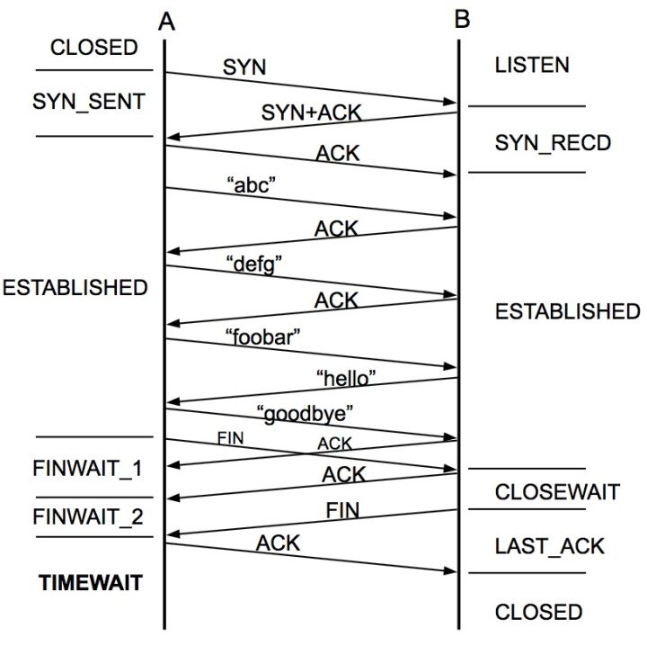
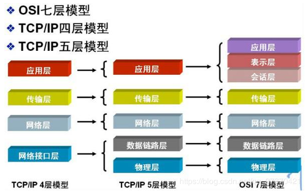

# 1. TCP/IP

## 1.1. TCP 与 UDP的不同

TCP的优点： 可靠，稳定 TCP的可靠体现在TCP在传递数据之前，会有三次握手来建立连接，而且在数据传递时，有确认、窗口、重传、拥塞控制机制，在数据传完后，还会断开连接用来节约系统资源。 TCP的缺点： 慢，效率低，占用系统资源高，易被攻击 TCP在传递数据之前，要先建连接，这会消耗时间，而且在数据传递时，确认机制、重传机制、拥塞控制机制等都会消耗大量的时间，而且要在每台设备上维护所有的传输连接，事实上，每个连接都会占用系统的CPU、内存等硬件资源。 而且，因为TCP有确认机制、三次握手机制，这些也导致TCP容易被人利用，实现DOS、DDOS、CC等攻击。

UDP的优点： 快，比TCP稍安全 UDP没有TCP的握手、确认、窗口、重传、拥塞控制等机制，UDP是一个无状态的传输协议，所以它在传递数据时非常快。没有TCP的这些机制，UDP较TCP被攻击者利用的漏洞就要少一些。但UDP也是无法避免攻击的，比如：UDP Flood攻击…… UDP的缺点： 不可靠，不稳定 因为UDP没有TCP那些可靠的机制，在数据传递时，如果网络质量不好，就会很容易丢包。 基于上面的优缺点，那么： 什么时候应该使用TCP： 当对网络通讯质量有要求的时候，比如：整个数据要准确无误的传递给对方，这往往用于一些要求可靠的应用，比如HTTP、HTTPS、FTP等传输文件的协议，POP、SMTP等邮件传输的协议。 在日常生活中，常见使用TCP协议的应用如下： 浏览器，用的HTTP FlashFXP，用的FTP Outlook，用的POP、SMTP Putty，用的Telnet、SSH QQ文件传输 ………… 什么时候应该使用UDP： 当对网络通讯质量要求不高的时候，要求网络通讯速度能尽量的快，这时就可以使用UDP。 比如，日常生活中，常见使用UDP协议的应用如下： QQ语音 QQ视频 TFTP ……

有些应用场景对可靠性要求不高会用到UPD，比如长视频，要求速率

**小结TCP与UDP的区别：**

1.基于连接与无连接；
2.对系统资源的要求（TCP较多，UDP少）；
3.UDP程序结构较简单；
4.流模式与数据报模式 ；

5.TCP保证数据正确性，UDP可能丢包，TCP保证数据顺序，UDP不保证。

 

```
tcp协议和udp协议的差别 
           TCP           UDP 
是否连接     面向连接     面向非连接 
传输可靠性   可靠        不可靠 
应用场合    少量数据    传输大量数据 

速度       慢         快

```

TCP与UDP区别总结：

1、TCP面向连接（如打电话要先拨号建立连接）;UDP是无连接的，即发送数据之前不需要建立连接

```
2、TCP提供可靠的服务。也就是说，通过TCP连接传送的数据，无差错，不丢失，不重复，且按序到达;UDP尽最大努力交付，即不保证可靠交付
3、TCP面向字节流，实际上是TCP把数据看成一连串无结构的字节流;UDP是面向报文的
UDP没有拥塞控制，因此网络出现拥塞不会使源主机的发送速率降低（对实时应用很有用，如IP电话，实时视频会议等）
4、每一条TCP连接只能是点到点的;UDP支持一对一，一对多，多对一和多对多的交互通信
5、TCP首部开销20字节;UDP的首部开销小，只有8个字节
```

6、TCP的逻辑通信信道是全双工的可靠信道，UDP则是不可靠信道


## 1.2. TCP 三次握手，四次握手

[三次握手，四次握手](https://blog.csdn.net/qq_38950316/article/details/81087809)

[三次握手](https://www.zhihu.com/question/24853633/answer/573627478)

三次握手

```
TCP A                                                TCP B
​
  1.  CLOSED                                               LISTEN
​
  2.  SYN-SENT    --> <SEQ=100><CTL=SYN>               --> SYN-RECEIVED
​
  3.  ESTABLISHED <-- <SEQ=300><ACK=101><CTL=SYN,ACK>  <-- SYN-RECEIVED
​
  4.  ESTABLISHED --> <SEQ=101><ACK=301><CTL=ACK>       --> ESTABLISHED
​
  5.  ESTABLISHED --> <SEQ=101><ACK=301><CTL=ACK><DATA> --> ESTABLISHED
​

```

- 第二行中， A 发送了 SEQ 100，标志位是 SYN；
- 第三行，B 发回了 ACK 101 与 SEQ 300，标志位是 SYN 与 ACK（两个过程合并了）。注意，ACK 是101意味着，B 希望接收到 101序列号开始的数据段。
- 第四行，A 返回了空的数据，SEQ 101， ACK 301，标志位为 ACK。至此，双方的开始 SEQ （也就是 ISN）号100与300都被确认接收到了。
- 第五行，开始正式发送数据包，注意的是 ACK 依旧是第四行的301，因为没有需要 ACK 的 SYN 了（第四行已经 ACK 完）。

以上，4 最后这个确认的过程，是可以带上数据的。


四次握手





## 1.3. 网络分层模型




## 1.4. 拥塞避免

[拥塞避免](https://www.cnblogs.com/hongdada/p/11206679.html)

[拥塞控制算法](https://www.cnblogs.com/peanutk/p/10200352.html)


# 2. HTTP

## 2.1. HTTP状态码

200 – 请求成功

 

301 – 资源(网页等)被永久转移到其它URL

 

404 – 请求的资源(网页等)不存在

 

500 – 内部服务器错误

 

HTTP状态码的分类

 

HTTP状态码由三个十进制数字组成，第一个十进制数字定义了状态码的类型，后两个数字没有分类的作用。HTTP状态码共分为5种类型：

 

分类分类描述

 

1**信息，服务器收到请求，需要请求者继续执行操作

 

2**成功，操作被成功接收并处理

 

3**重定向，需要进一步的操作以完成请求

 

4**客户端错误，请求包含语法错误或无法完成请求

 

5**服务器错误，服务器在处理请求的过程中发生了错误


## 2.2. HTTP长连接和短连接

- 长连接：client方与server方先建立连接，连接建立后不断开，然后再进行报文发送和接收。这种方式下由于通讯连接一直存在。此种方式常用于P2P通信。
- 短连接：Client方与server每进行一次报文收发交易时才进行通讯连接，交易完毕后立即断开连接。此方式常用于一点对多点通讯。C/S通信。

#### 长连接与短连接的操作过程

短连接的操作步骤是：

建立连接——数据传输——关闭连接...建立连接——数据传输——关闭连接

[长连接](http://www.nowamagic.net/academy/tag/长连接)的操作步骤是：

建立连接——数据传输...（保持连接）...数据传输——关闭连接


2. url URI的区别

   在WWW上，每一信息资源都有统一的且在网上唯一的地址，该地址就叫**URL**（**Uniform Resource Locator,统一资源定位符**），它是WWW的统一资源定位标志，就是**指网络地址**。

   URL由三部分组成：资源类型、存放资源的主机域名、资源文件名，也可认为由4部分组成：协议、主机、端口、路径。

   　　URL的一般语法格式为：(带方括号[]的为可选项)：

   　　**protocol :// hostname[:port] / path / [;parameters][?query]#fragment**

   　　例如http://www.baidu.com:80/


​	在电脑术语中，**统一资源标识符（Uniform Resource Identifier，URI)**是一个用于标识某一互联网资源名称的字符串。 该种标识允许用户对任何（包括本地和互联网）的资源通过特定的协议进行交互操作。URI由包括确定语法和相关协议的方案所定义。　　

​	URI格式由URI协议名（例如HTTP、FTP、mailto、file），一个冒号，和协议对应的内容所构成。特定的协议定义了协议内容的语法和语义，而所有的协议都必须遵循一定的URI文法通用规则，亦即为某些专门目的保留部分特殊字符。URI文法同时也就各种原因对协议内容加以其他的限制，例如，保证各种分层协议之间的协同性。百分号编码也为URI提供附加信息。

　　URL的格式由下列三部分组成:，第一部分是协议（或称为服务方式）；第二部分是存有该资源的主机IP地址（有时也包括端口号）；第三部分是主机资源的具体地址。

　　具体URI的格式如下：

　　**[协议名]://[用户名]:[密码]@[服务器地址]:[服务器端口号]/[路径]?[查询字符串]#[片段ID]**


URL是URI的子集


## 2.3. URL访问过程

客户端获取URL - > DNS解析 - > TCP连接 - >发送HTTP请求 - >服务器处理请求 - >返回报文 - >浏览器解析渲染页面 - > TCP断开连接


DNS解析流程：输入url后，浏览器先检查自己的缓存，若没有则检查本地的DNS，/eth/hosts, 若没有，则向本地配置的DNS服务器发起解析请求/etc/resolv.conf,

若无，在向上一级域名服务器请求，直到找到根域名服务器


## 2.4. ARP

地址解析协议，即ARP（Address Resolution Protocol），是根据[IP地址](https://baike.baidu.com/item/IP地址)获取[物理地址](https://baike.baidu.com/item/物理地址/2129)的一个[TCP/IP协议](https://baike.baidu.com/item/TCP%2FIP协议)。[主机](https://baike.baidu.com/item/主机/455151)发送信息时将包含目标IP地址的ARP请求广播到局域网络上的所有主机，并接收返回消息，以此确定目标的物理地址；收到返回消息后将该IP地址和物理地址存入本机ARP缓存中并保留一定时间，下次请求时直接查询ARP缓存以节约资源。地址解析协议是建立在网络中各个主机互相信任的基础上的，局域网络上的主机可以自主发送ARP应答消息，其他主机收到应答报文时不会检测该报文的真实性就会将其记入本机ARP缓存；由此攻击者就可以向某一主机发送伪ARP应答报文，使其发送的信息无法到达预期的主机或到达错误的主机，这就构成了一个[ARP欺骗](https://baike.baidu.com/item/ARP欺骗)。